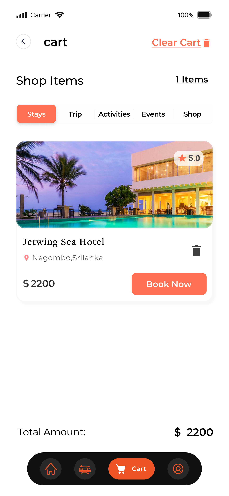

# Trip Me

Trip Me is a comprehensive trip, tour, activity, and hotel booking application built using Flutter and Next.js. It leverages MySQL with Prisma ORM for database management and is available on both iOS and Android platforms.

## Features

- **Trip Booking**: Easily book trips to various destinations.
- **Tour Booking**: Explore and book guided tours.
- **Activity Booking**: Find and book activities to enhance your travel experience.
- **Hotel Booking**: Search and book hotels at your destination.
- **Event Booking**: Search and enter your favourite event near your buy tickets.

## Technologies Used

- **Frontend**: Flutter, Next.js
- **Backend**: Node.js, Express
- **Database**: MySQL with Prisma ORM

## Screenshots

<div align='center'>
<table>
  <tr>
    <td></td>
    <td></td>
  </tr>
  <tr>
    <td></td>
    <td></td>
  </tr>
  <tr>
    <td></td>
    <td></td>
  </tr>
  <tr>
    <td></td>
    <td></td>
  </tr>
</table>
</div>

## IMPORTANT

This repo does not contain any code implementations for privacy reasons.

## License

This project is licensed under the MIT License.

## Contact

For any inquiries, please contact us at [email@example.com](mailto:kushangayantha001@gmail.com).

```javascript
console.log("Thank You for Visiting")
console.log("⭐⭐⭐⭐⭐ give me a star ⭐⭐⭐⭐⭐")
```
